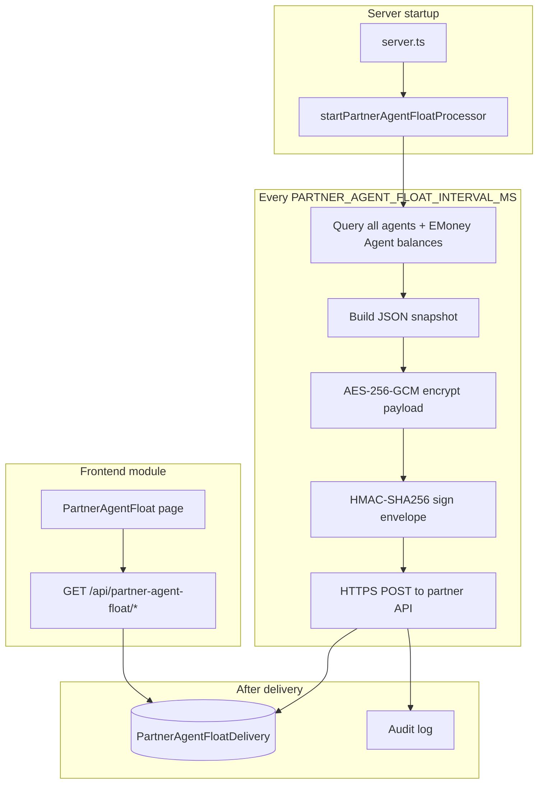

# Partner Agent Float Balance Sync

## Goal

Periodically export **every agent's** EMoney float balance on the **Agent** ledger entity (including agents with **zero balance / no recent transactions**), and POST it to the partner's server as an encrypted, authenticated payload they can decrypt and merge into their records.

**Confirmed payload shape:**
- `agent_number` = agent mobile (`agent_users.mobile` / `transactions.user_identifier`)
- `after_balance` = latest `after_balance` on Agent entity + EMoney pouch (or `0` if none)
- `balance_as_of` = timestamp of the transaction that produced that balance (or `snapshot_at` when balance is 0 / never transacted)

---

## Architecture



This mirrors existing background processors ([`backend/src/schedules/processor.ts`](backend/src/schedules/processor.ts), [`backend/src/directpay/subscription-reminder-processor.ts`](backend/src/directpay/subscription-reminder-processor.ts)) but delivers via **outbound HTTPS** instead of email (like [`backend/src/directpay/client.ts`](backend/src/directpay/client.ts)).

---

## 1. Balance query (all agents, EMoney only)

New SQL module: [`backend/src/partner-agent-float/query.ts`](backend/src/partner-agent-float/query.ts)

Reuse patterns from [`backend/scripts/validate-balance-reports.ts`](backend/scripts/validate-balance-reports.ts) and [`backend/scripts/report-sql-constants.ts`](backend/scripts/report-sql-constants.ts):

```sql
-- Conceptual shape (start from agents, not from transactions)
WITH agent_entity AS (
  SELECT id FROM entities WHERE name = 'Agent' AND deleted_at IS NULL LIMIT 1
),
emoney_pouch AS (
  SELECT id FROM pouches WHERE name = 'EMoney' AND deleted_at IS NULL LIMIT 1
),
agents AS (
  SELECT DISTINCT ON (au.mobile)
    au.mobile AS agent_number
  FROM agent_users au
  WHERE au.deleted_at IS NULL AND au.mobile IS NOT NULL
  ORDER BY au.mobile, /* Active profile preference — same as PROFILE_DEDUPE_ORDER */
),
latest_balances AS (
  SELECT DISTINCT ON (t.user_identifier)
    t.user_identifier,
    t.after_balance::numeric AS after_balance,
    t.created_at AS balance_as_of
  FROM transactions t
  INNER JOIN agent_entity ae ON ae.id = t.entity_id
  INNER JOIN emoney_pouch ep ON ep.id = t.pouch_id
  WHERE t.deleted_at IS NULL
    AND t.after_balance IS NOT NULL
    AND t.created_at <= :snapshotAt
  ORDER BY t.user_identifier, t.created_at DESC, t.id DESC
)
SELECT
  a.agent_number,
  COALESCE(lb.after_balance, 0) AS after_balance,
  COALESCE(lb.balance_as_of, :snapshotAt) AS balance_as_of
FROM agents a
LEFT JOIN latest_balances lb ON lb.user_identifier = a.agent_number
ORDER BY a.agent_number
```

Execute via existing [`executeDataSourceQuery`](backend/src/datasources/service.ts) against the org's active APS Wallet datasource (same as scheduled reports).

---

## 2. Partner delivery — recommended security model

**Three layers** (defense in depth, consistent with existing crypto/HMAC patterns):

| Layer | Mechanism | Purpose |
|-------|-----------|---------|
| Transport | HTTPS (TLS 1.2+) | Encrypts data in transit |
| Authentication | `Authorization: Bearer {PARTNER_AGENT_FLOAT_API_KEY}` | Only biReports can call the endpoint |
| Integrity | `X-BIReports-Signature: sha256={hex}` HMAC of raw request body | Partner verifies payload was not tampered with (same pattern as DirectPay webhooks in [`backend/src/routes/webhooks/directpay.ts`](backend/src/routes/webhooks/directpay.ts)) |
| Confidentiality | AES-256-GCM encrypted inner payload | Partner decrypts even if TLS is terminated early / logged |

### Wire format (outer envelope — sent in POST body)

```json
{
  "schema_version": 1,
  "delivery_id": "550e8400-e29b-41d4-a716-446655440000",
  "snapshot_at": "2026-06-26T12:05:00.000Z",
  "record_count": 4821,
  "algorithm": "aes-256-gcm",
  "encrypted_payload": "<base64(iv + authTag + ciphertext)>"
}
```

Headers:
- `Authorization: Bearer <api_key>`
- `X-BIReports-Delivery-Id: <delivery_id>`
- `X-BIReports-Signature: sha256=<hmac_sha256_hex(raw_body)>`
- `Content-Type: application/json`

### Decrypted inner payload

```json
{
  "schema_version": 1,
  "delivery_id": "550e8400-e29b-41d4-a716-446655440000",
  "snapshot_at": "2026-06-26T12:05:00.000Z",
  "agents": [
    {
      "agent_number": "7957051",
      "after_balance": "12450.00",
      "balance_as_of": "2026-06-26T11:58:32.000Z"
    }
  ]
}
```

Encryption reuses the existing AES-256-GCM layout from [`backend/src/datasources/crypto.ts`](backend/src/datasources/crypto.ts) (`iv(12) + authTag(16) + ciphertext` → base64), but with a **separate** `PARTNER_AGENT_FLOAT_ENCRYPTION_KEY` (32-byte base64) shared out-of-band with the partner.

### Partner decryption + merge (document for partner)

1. **Verify signature** — recompute `HMAC-SHA256(raw_body, PARTNER_AGENT_FLOAT_HMAC_SECRET)` and compare to `X-BIReports-Signature` (strip `sha256=` prefix).
2. **Reject duplicates** — if `delivery_id` already processed, return `200` without re-applying (idempotent retries).
3. **Decrypt** — base64-decode `encrypted_payload`, split iv/tag/ciphertext, decrypt with shared AES key.
4. **Validate** — check `record_count === agents.length`, `schema_version === 1`.
5. **Merge** — recommended upsert per agent:
   - Key: `agent_number`
   - Only apply if `snapshot_at` is newer than stored `last_snapshot_at` (or use `delivery_id` ordering)
   - Store: `after_balance`, `balance_as_of`, `received_at`, `delivery_id`

Balances should be sent as **strings** (decimal) to avoid floating-point drift across systems.

---

## 3. Background processor

New files:
- [`backend/src/partner-agent-float/processor.ts`](backend/src/partner-agent-float/processor.ts) — `setInterval` + `processing` mutex (same as schedule processor)
- [`backend/src/partner-agent-float/service.ts`](backend/src/partner-agent-float/service.ts) — orchestrate query → encrypt → deliver → persist
- [`backend/src/partner-agent-float/client.ts`](backend/src/partner-agent-float/client.ts) — `fetch()` to partner URL with timeout + retries
- [`backend/src/partner-agent-float/crypto.ts`](backend/src/partner-agent-float/crypto.ts) — encrypt + sign helpers

Start in [`backend/src/server.ts`](backend/src/server.ts) when `PARTNER_AGENT_FLOAT_ENABLED=true`.

**Retry policy:** 3 attempts with exponential backoff; on final failure mark delivery `FAILED` and store error message. Successful partner `2xx` → `SUCCESS`.

**Manual trigger:** `POST /api/partner-agent-float/run` (permission-gated) for ops testing without waiting for interval.

---

## 4. Persistence (delivery history)

Add Prisma model `PartnerAgentFloatDelivery` in [`backend/prisma/schema.prisma`](backend/prisma/schema.prisma):

| Field | Type | Notes |
|-------|------|-------|
| `id` | uuid | PK |
| `deliveryId` | uuid | unique, sent to partner |
| `snapshotAt` | DateTime | run timestamp |
| `recordCount` | Int | agent rows |
| `status` | enum | `SUCCESS`, `FAILED`, `RUNNING` |
| `httpStatus` | Int? | partner response code |
| `errorMessage` | String? | truncated |
| `durationMs` | Int? | |
| `createdAt` | DateTime | |

No need to store full agent payloads in DB (can be large); UI preview re-runs query on demand.

---

## 5. Environment configuration

Add to [`backend/src/env.ts`](backend/src/env.ts) and [`backend/.env.example`](backend/.env.example):

| Variable | Default | Purpose |
|----------|---------|---------|
| `PARTNER_AGENT_FLOAT_ENABLED` | `false` | Master switch |
| `PARTNER_AGENT_FLOAT_INTERVAL_MS` | `300000` (5 min) | Poll interval (min 60s) |
| `PARTNER_AGENT_FLOAT_API_URL` | — | Partner ingest endpoint |
| `PARTNER_AGENT_FLOAT_API_KEY` | — | Bearer token |
| `PARTNER_AGENT_FLOAT_HMAC_SECRET` | — | Shared signing secret |
| `PARTNER_AGENT_FLOAT_ENCRYPTION_KEY` | — | 32-byte base64 AES key |
| `PARTNER_AGENT_FLOAT_REQUEST_TIMEOUT_MS` | `30000` | HTTP timeout |

Processor logs a warning and stays idle if enabled but URL/secrets are missing.

---

## 6. Standalone UI module (main menu)

Register as module key `partner-agent-float` (or `agent-float-sync`).

| File | Change |
|------|--------|
| [`backend/src/auth/permissions.ts`](backend/src/auth/permissions.ts) | Add module; actions: `view`, `edit` (for manual run) |
| [`frontend/src/components/layout/Sidebar.tsx`](frontend/src/components/layout/Sidebar.tsx) | Add under **Overview** next to Reports/Statements: "Agent Float Sync" |
| [`frontend/src/App.tsx`](frontend/src/App.tsx) | Route `/partner-agent-float` |
| [`frontend/src/pages/PartnerAgentFloat.tsx`](frontend/src/pages/PartnerAgentFloat.tsx) | New page |
| [`frontend/src/api/partnerAgentFloat.ts`](frontend/src/api/partnerAgentFloat.ts) | API client |
| [`backend/src/routes/partner-agent-float.ts`](backend/src/routes/partner-agent-float.ts) | REST endpoints |

**Page contents:**
- Config status card (enabled, interval, partner URL masked, last keys configured yes/no)
- KPIs: last run time, last status, record count, next scheduled run
- Delivery history table (from `PartnerAgentFloatDelivery`)
- "Run now" button (requires `partner-agent-float:edit`)
- "Preview snapshot" — returns current query results without sending (read-only)

Re-run `prisma migrate` + seed so permissions exist for role assignment.

---

## 7. Partner integration doc

Add [`docs/partner-agent-float-integration.md`](docs/partner-agent-float-integration.md) covering:
- Endpoint expectations (accept POST, return `2xx` with optional `{ "accepted": true }`)
- Header/signature verification (with Node.js + Python examples)
- AES-256-GCM decryption steps matching our wire format
- Idempotency via `delivery_id`
- Merge/upsert recommendation
- Sample request/response

This directly answers the partner-facing half of the requirement.

---

## 8. Testing approach

- Unit tests for encrypt/sign/verify round-trip and HMAC verification
- Integration test with mock partner HTTP server (verify headers, decrypt payload, idempotency)
- Manual: enable test mode pointing at webhook.site or local mock; confirm all agents appear including zero-balance ones

---

## Key files to leverage

- Balance SQL patterns: [`backend/scripts/validate-balance-reports.ts`](backend/scripts/validate-balance-reports.ts)
- EMoney constant: [`backend/scripts/report-sql-constants.ts`](backend/scripts/report-sql-constants.ts)
- AES-GCM: [`backend/src/datasources/crypto.ts`](backend/src/datasources/crypto.ts)
- HMAC webhook pattern: [`backend/src/directpay/client.ts`](backend/src/directpay/client.ts)
- Interval processor pattern: [`backend/src/schedules/processor.ts`](backend/src/schedules/processor.ts)
